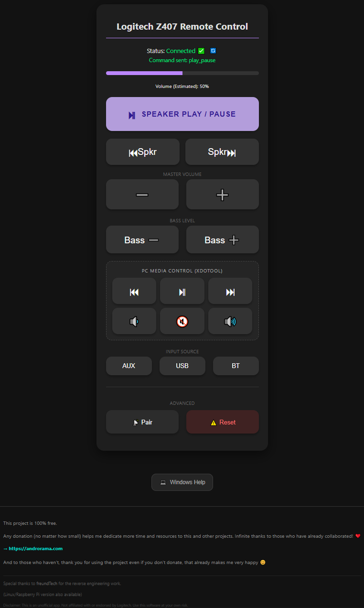

# Logitech Z407 Remote Control (Windows Edition)

A simple web-based remote control for Logitech Z407 speakers.
Controls your speakers via Bluetooth Low Energy (BLE) from any browser on your network (Phone, Tablet, etc.).

*(Note: There is also a version for Linux/Raspberry Pi available).*

*Tip: If this version fails to connect to your speakers, try downloading a previous release (the connection logic has been updated in this version).*

<div align="center">
  
</div>


## Features
- **Volume Control:** Adjust Z407 volume nicely.
- **Media Control:** Play/Pause, Next/Prev Track.
- **PC Control:** Simulate media keys on your PC (Play/Pause/Mute Spotify or YouTube remotely).
- **Input Selection:** Switch between Bluetooth, Aux, and USB.

## Requirements
- Windows 10 or Windows 11.
- Bluetooth Adapter (Internal or USB Dongle).
- Python 3.10+ (The build script handles this automatically).

## How to Install / Build
1. Download this folder.
2. Put your `icon.png` in the folder (optional, if you want a custom icon).
3. Double click on **`build_windows.bat`**.
4. Follow the instructions on screen.
   - It will check for Python (and install it if needed).
   - It will install dependencies.
   - It will create a standalone **`Z407_Control_Windows.exe`** in the `dist` folder.

## How to Use
1. Run the generated **`Z407_Control_Windows.exe`** (you can move it anywhere on your PC).
2. A console window will open showing a URL (e.g., `http://192.168.1.50:5000`).
3. Open that URL on your phone or any other device connected to the same Wi-Fi.
4. **Enjoy!**

## Advanced Configuration (Manual IP/Port)
By default, the app listens on all interfaces (0.0.0.0) at port 5000.
If you need to change this using the command line:

```powershell
Z407_Control_Windows.exe --ip 127.0.0.1 --port 8080
```

## Troubleshooting
- **Black Window pauses?** Don't click inside the black console window, or press Enter to resume it.
- **Firewall / VPN:** If your phone can't load the page, check Windows Firewall settings (allow the app). If using a **VPN**, enable **"Allow LAN access"** or **"Split Tunneling"** in your VPN settings so devices on your local network can still connect.
- **Connection Failed:** Make sure no other device is currently controlling the speakers via Bluetooth app.
- **Icon Error:** If the build fails saying it can't find `icon.ico`, make sure you have `icon.png` in the root folder, or delete it to use the default icon.

### Connection Troubleshooting Steps
If the connection keeps failing, please try the following steps in this order:
1. Disconnect and reconnect the speakers from the power outlet.
2. Turn Bluetooth off and on again on your computer.
3. Unpair and re-pair the Z407 device.
4. Restart your computer.

## Credits
Based on the reverse engineering work by [freundTech](https://github.com/freundTech/logi-z407-reverse-engineering).
Similar App: https://www.reddit.com/r/logitech/comments/1eny8nh/control_your_logitech_z407_speakers_with_this/?tl=es-es
Web App implementation by **Androrama**.

## Reddit post: https://www.reddit.com/r/logitech/comments/1eny8nh/control_your_logitech_z407_speakers_with_this/?tl=es-es

## Disclaimer
This project is an unofficial open-source application and is **NOT** affiliated with, endorsed by, or connected to **Logitech (Logi)**.
Use this software at your own risk.

## ❤️ Donations & Support

**This project is 100% free.**

Any donation (no matter how small) helps me dedicate more time and resources to this and other projects. Infinite thanks to those who have already collaborated! ❤️

→ [https://androrama.com](https://androrama.com)

And to those who haven't, thank you for using the project even if you don't donate, that already makes me very happy 😊
